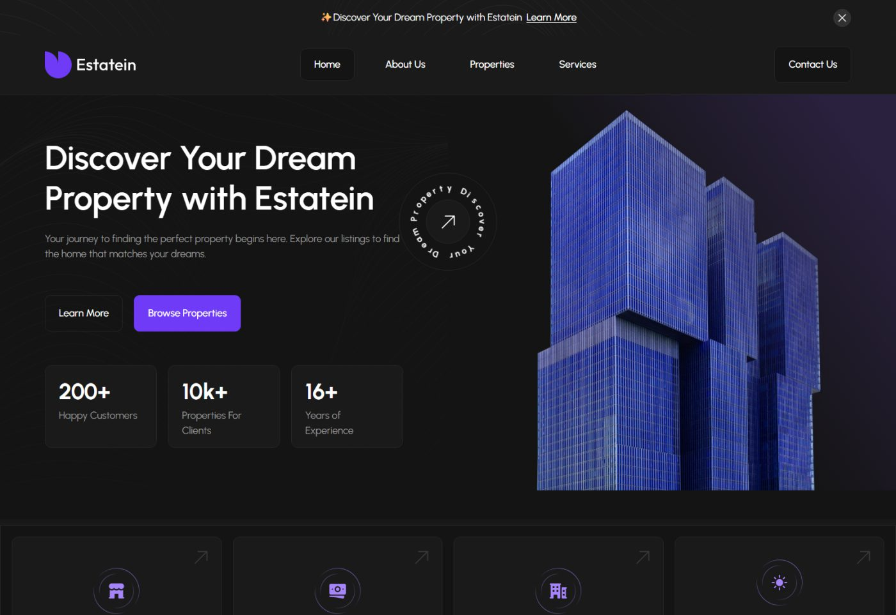
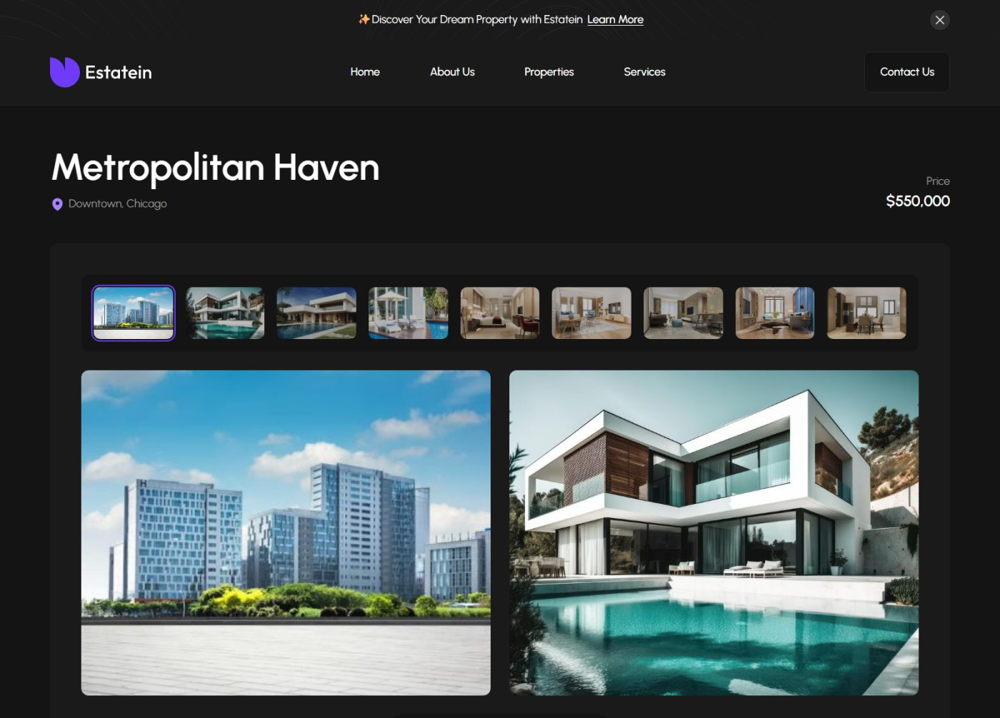
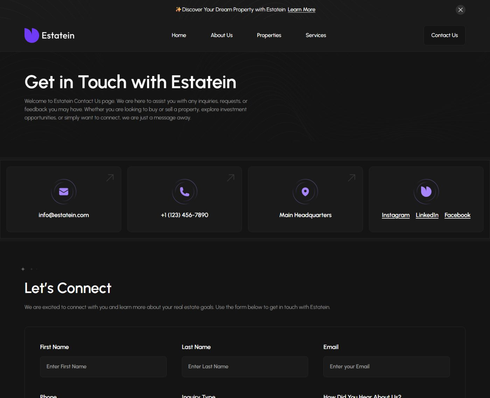
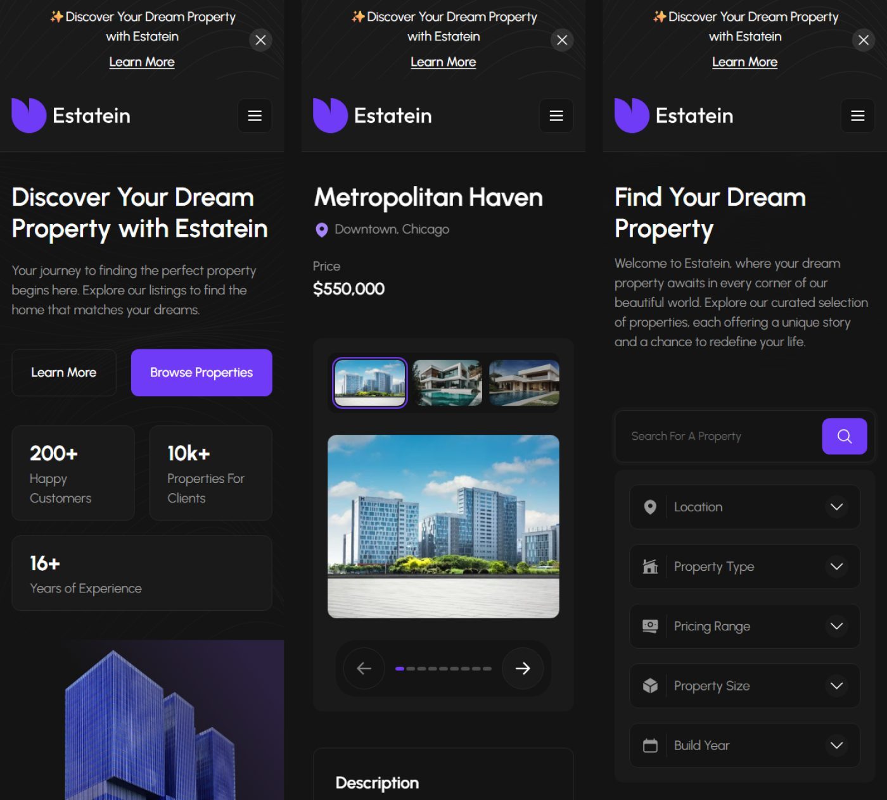

# Estatein

A custom WordPress theme built from the [Estatein real estate Figma template](https://www.figma.com/community/file/1314076616839640516). No page builder, no starter theme, no framework — hand-written PHP, CSS and JavaScript.



## Pages

| | |
|---|---|
|  |  |
| **Property details** — thumbnail strip over a two-up gallery, key features, an inquiry form pre-filled with the listing, and four pricing cards. | **Properties** — search and five filters, all working without JavaScript because the form submits with GET. |



## Responsive

Every breakpoint comes from the Figma frames — desktop at 1920, laptop at 1440, mobile at 390.



## What the client edits

Nothing on the front end is hard-coded. Content is split three ways:

- **Pages** — heading, intro, hero statistics and the feature tiles, per page.
- **Properties, Testimonials, Team, FAQs** — custom post types, with taxonomies for property type and location.
- **Site Settings** — announcement bar, contact details, social links and the closing call to action.

Repeating content (statistics, feature tiles, key features, pricing rows) is stored as delimited lines, because ACF's Repeater is a PRO feature. A small row editor sits over those fields in the admin, so an editor sees a table with add, remove and reorder controls rather than a textarea.

## Running it

Requires PHP 7.4+ and WordPress 6.0+.

1. Copy this directory to `wp-content/themes/estatein` and activate it.
2. Install Advanced Custom Fields, Contact Form 7 and Rank Math SEO. All three are optional — the theme registers its own meta boxes, ships its own form markup and emits its own metadata when they are absent.
3. Import `demo-content/estatein-demo.sql`, then point the site at its own URL:

   ```sql
   UPDATE wp_options SET option_value = 'https://your-site'
   WHERE option_name IN ('siteurl', 'home');
   ```

   The export carries no user accounts, so create an administrator afterwards.

Or build the content from scratch instead of importing:

```bash
php wp-content/themes/estatein/tools/seed-demo-content.php   # listings, posts, team, FAQs
php wp-content/themes/estatein/tools/create-menus.php        # header and footer menus
php wp-content/themes/estatein/tools/create-forms.php        # Contact Form 7 forms
php wp-content/themes/estatein/tools/seed-page-content.php   # page fields and Site Settings
php wp-content/themes/estatein/tools/seed-seo.php            # Rank Math titles and keywords
```

## Layout

```
inc/          post types, meta, ACF groups, settings, forms, queries, SEO
template-parts/  home sections and shared components
tools/        CLI scripts for provisioning and export
assets/       source CSS and JS, plus the minified files that are served
```

`assets/css/main.css` and `assets/js/main.js` are the sources. `tools/minify-assets.php` writes the `.min` files, which is what the theme enqueues unless `SCRIPT_DEBUG` is on.

## Notes

- JavaScript is progressive enhancement throughout. Carousels, the gallery, filters, FAQ toggles and the mobile menu all work without it.
- Accessibility: one `h1` per page, labelled form controls, visible focus, off-screen carousel items removed from the tab order, and `prefers-reduced-motion` respected.
- SEO: the theme emits its own metadata and `RealEstateListing` schema, and stands down when Rank Math, Yoast or AIOSEO is active — feeding Rank Math the description and listing schema it cannot derive from custom fields.
